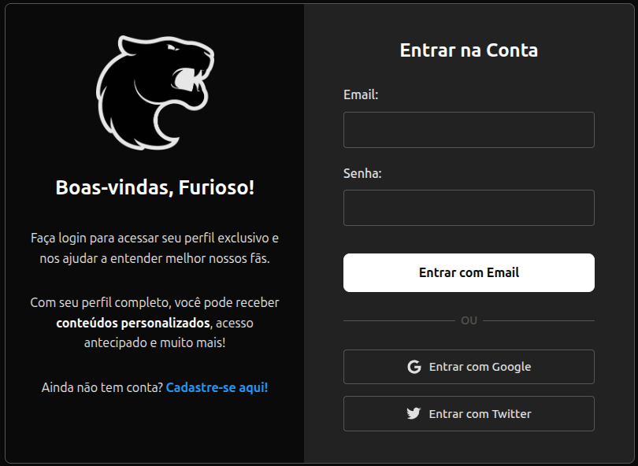
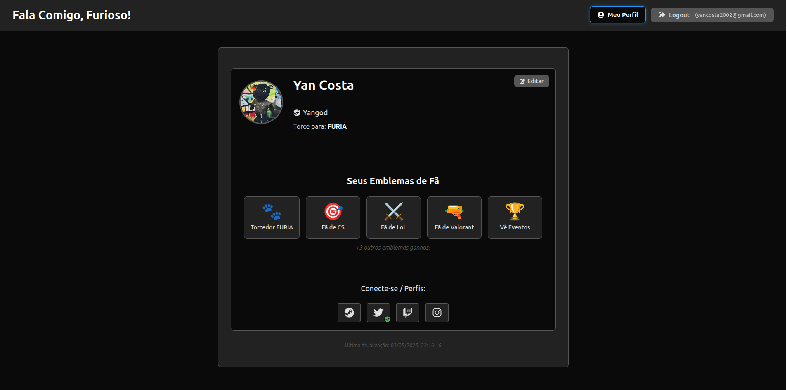

# Fala Comigo, Furioso! 🐾

<!-- Adicione aqui um link para uma imagem da logo da FURIA, se desejar -->
<!-- Exemplo:  -->

**Aplicação em Produção (Vercel):** [**Acesse Aqui!**](https://knowyourfan-furia.vercel.app/) <!-- Link direto para a app -->

**Repositório GitHub:** [**Ver Código Fonte**](https://github.com/yanocosta02/knowyourfan-furia.git)

---

## 🚀 Visão Geral

**Fala Comigo, Furioso!** é a plataforma de conexão definitiva para os fãs da FURIA Esports! Crie seu perfil de fã personalizado, compartilhe seus gostos, jogos favoritos, times que acompanha e muito mais. Ao se conectar, você ajuda a FURIA a entender melhor sua incrível comunidade e nos permite criar experiências e conteúdos cada vez mais incríveis e direcionados para você, membro da Legião!

Esta aplicação é um MVP (Minimum Viable Product) construído com a agilidade do **React (Vite)** e a robustez do **Firebase**, demonstrando um fluxo completo desde a autenticação até a exibição de um perfil rico em informações e emblemas.

## ✨ Funcionalidades Implementadas

- **Autenticação Flexível:**
  - Cadastro e Login com Email/Senha.
  - Login Social rápido com **Google** e **Twitter**.
  - Vinculação e Desvinculação de contas Google/Twitter ao perfil.
- **Wizard de Criação de Perfil (5 Etapas):**
  - **Pessoal/ID:** Nome, CPF (com máscara `***.***.***-**`), Data Nascimento, Endereço, URL do Avatar e Upload de Documento de ID (validação simulada).
  - **Steam:** Nickname/ID do perfil Steam.
  - **Interesses:** Seleção de **Time Favorito** (único) via dropdown e adição de **Jogos** e **Eventos** favoritos/assistidos usando **Tags** com sugestões pré-definidas.
  - **Compras:** Adição de compras recentes relacionadas usando **Tags** com sugestões pré-definidas.
  - **Social:** Adição de links para perfis no Twitter, Twitch e Instagram e conexão de contas Google/Twitter.
- **Visualização Dinâmica do Perfil:**
  - Exibição clara do Avatar, Nome, Nick Steam e Time Favorito.
  - Selo "Verificado" (baseado na simulação de validação de ID).
  - **Emblemas (Badges) Dinâmicos:** Até 5 emblemas exibidos com base nas informações preenchidas.
  - Acesso rápido aos links sociais e perfis conectados.
  - Botão "Editar" para retornar ao modo de preenchimento (wizard).
- **Interface Moderna:** Tema escuro inspirado na identidade visual da FURIA, layout adaptável e navegação clara.

## 🛠️ Tecnologias Utilizadas

- **Frontend:**
  - [React](https://reactjs.org/) (com [Vite](https://vitejs.dev/))
  - [React Router DOM](https://reactrouter.com/)
  - [React Icons](https://react-icons.github.io/react-icons/)
  - CSS (Padrão / CSS Modules)
- **Backend & Serviços:**
  - [Firebase](https://firebase.google.com/)
    - **Authentication:** Gerenciamento de usuários (Email/Senha, Google, Twitter).
    - **Firestore:** Banco de dados NoSQL para perfis.
- **Hospedagem:**
  - [Vercel](https://vercel.com/)

## 📸 Screenshots

Abaixo estão algumas imagens da aplicação em ação:

<div style="display: flex; gap: 10px; flex-wrap: wrap;">
  
  
</div>

> 📌 \_As imagens acima ilustram a tela inicial e o perfil com os respectivos emblemas do fã.

## ⚙️ Configuração e Execução Local

**Pré-requisitos:**

- [Node.js](https://nodejs.org/) (versão LTS recomendada)
- [npm](https://www.npmjs.com/)
- Conta no [Firebase](https://firebase.google.com/) (o projeto já existe, você precisará das suas próprias credenciais para rodar localmente).

**Passos:**

1.  **Clone o Repositório:**

    ```bash
    git clone https://github.com/yanocosta02/knowyourfan-furia.git
    cd knowyourfan-furia
    ```

2.  **Instale as Dependências:**

    ```bash
    npm install
    ```

3.  **Configure o Firebase (para rodar localmente):**

    - Crie seu próprio projeto no [Console do Firebase](https://console.firebase.google.com/) ou peça acesso ao projeto existente (se aplicável).
    - **Habilite Serviços:** Siga os mesmos passos de habilitação (Auth com provedores, Firestore) descritos na seção de Deploy da Vercel.
    - Obtenha as **suas** credenciais Web do Firebase.
    - **Crie um arquivo `.env`** na raiz do projeto clonado.
    - **Adicione suas credenciais Firebase** ao `.env`, prefixando cada chave com `VITE_`:
      ```dotenv
      # .env (Exemplo - Use seus valores reais!)
      VITE_FIREBASE_API_KEY=SUA_API_KEY
      VITE_FIREBASE_AUTH_DOMAIN=SEU_AUTH_DOMAIN
      VITE_FIREBASE_PROJECT_ID=SEU_PROJECT_ID
      VITE_FIREBASE_STORAGE_BUCKET=SEU_STORAGE_BUCKET
      VITE_FIREBASE_MESSAGING_SENDER_ID=SEU_MESSAGING_SENDER_ID
      VITE_FIREBASE_APP_ID=SEU_APP_ID
      ```
    - **IMPORTANTE:** Adicione este arquivo `.env` ao seu `.gitignore` local se fizer modificações nele que não devem ir para o repositório principal. O `.gitignore` do projeto já deve ignorá-lo.
    - Verifique se `src/firebaseConfig.js` está configurado para ler do `.env` via `import.meta.env.VITE_...`.

4.  **Execute Localmente:**
    ```bash
    npm run dev
    ```
    Acesse `http://localhost:xxxx` (a porta será indicada no terminal).

## ⚠️ Limitações Atuais (MVP)

- **Validação de ID:** A funcionalidade é **simulada** no frontend; nenhuma análise de imagem real ocorre.
- **Validação de Link Esports:** Também é **simulada**.
- **Upload de Avatar/ID:** Implementado via **URL externa**. O upload direto de arquivos requer o plano Blaze do Firebase e a ativação do Cloud Storage.
- **Login Social (Twitch/Steam/etc):** Apenas Google e Twitter estão implementados nativamente.
- **Sugestões (Tags):** Baseadas em **listas fixas** definidas no código (`constants.js`).
- **Regras de Segurança Firebase:** Atualmente configuradas para modo de teste. **Precisam ser revisadas e protegidas para produção.**

## 🌱 Próximos Passos e Melhorias Possíveis

- Implementar validação **real** de ID e links com IA (backend/Functions).
- Implementar **upload de arquivos** (Storage/Plano Blaze).
- Adicionar mais opções de **login/vinculação social** (Custom Auth).
- Criar sistema de **sugestões dinâmico**.
- Refinar **UI/UX** e **responsividade**.
- Configurar **Regras de Segurança** de produção no Firebase.
- Adicionar **testes**.
- Desenvolver **funcionalidades baseadas no perfil** coletado.
- **Gamificação:** Expandir sistema de emblemas.

## 🚀 Deploy (Vercel)

- Esta aplicação está configurada para deploy contínuo na Vercel a partir do branch `main`.
- As **variáveis de ambiente do Firebase** (ex: `VITE_FIREBASE_API_KEY`, etc.) **já estão configuradas** diretamente no painel da Vercel para este projeto.
- A Vercel utiliza o arquivo `vercel.json` presente no repositório para configurar os redirecionamentos necessários para o React Router (SPA).
- **Qualquer push** para o branch configurado na Vercel acionará um novo deploy.

- Você pode testar o chatbot agora mesmo no link: [**knowyourfan-furia.vercel.app**](https://knowyourfan-furia.vercel.app/)

### 🙋‍♂️ Autor

Desenvolvido com 💻 e paixão pelo universo dos esports por [**Yan Oliveira da Costa**](https://github.com/yanocosta02).
